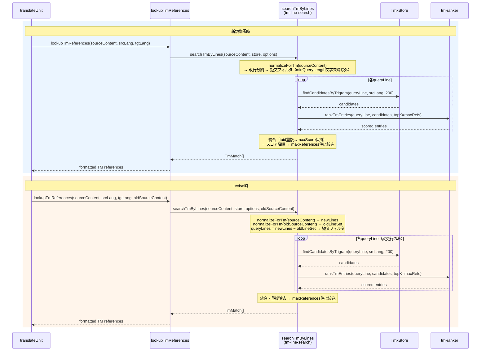

# チケット: TM検索行単位化・revise対応

## 1. 概要と方針

TM検索のクエリ粒度をユニット全体から行単位に変更し、Jaccard類似度の精度を向上させる。revise時はdiffで変更された行のみをTM検索対象にし、ノイズを削減する。normalize後の短文はフィルタで除外する。

## 2. 仕様

### 2.1 行単位TM検索
- ユニットのソーステキストをnormalize（`normalizeForTm`）した後、改行で分割し行ごとにTM検索する
- normalize後の行が設定値（デフォルト10文字）未満の場合は検索対象から除外する（テーブル断片等のノイズ防止）
- 各行のTM検索結果を統合し、重複を除去して最終候補とする
- 最低文字数の閾値は設定可能（`tm.minQueryLength`）

### 2.2 revise時diff対応
- revise時はsourceDiffから変更された行を特定し、その行のみをTM検索対象とする
- 変更のない行はTM検索をスキップ（すでにTMに登録済みの文がヒットするノイズを防ぐ）

### 2.3 候補数
- 行ごとにtopK件を取得した後、統合結果から最終的にmaxReferences件に絞る
- 長いユニットでは行数が多い分、自然に多くの候補が検索される

### 2.4 設定項目の追加
- `tm.minQueryLength`: TM検索時の最低文字数フィルタ（デフォルト10、範囲1-100）

## 3. シーケンス図



## 4. 設計

### 4.1 アーキテクチャ概要

行単位TM検索パイプラインを新モジュール `tm-line-search.ts`（`core/tm/`内）として追加する。既存の `TmxStore`・`tm-ranker`・`tm-text-normalizer` は変更しない。

**P8原則との整合性**: `searchTmByLines` は `core/tm/` モジュール内に配置するため、`normalizeForTm` の呼び出しはモジュール境界内に閉じる。外部呼び出し元（`lookupTmReferences`）は生テキストを渡すのみ。さらに `normalizeForTm` はべき等（正規化済みテキストに再適用しても結果不変）であるため、各行を `findCandidatesByTrigram` / `rankTmEntries` に渡す際に内部で再度呼ばれても副作用なし。

### 4.2 新モジュール: `src/core/tm/tm-line-search.ts`

**関数シグネチャ**:

```
searchTmByLines(
  sourceContent: string,        // 生テキスト（Markdown含む）
  store: TmxStore,
  options: TmLineSearchOptions,
  oldSourceContent?: string     // revise時の旧ソーステキスト
): TmMatch[]

TmLineSearchOptions {
  minQueryLength: number        // 最低クエリ文字数
  maxReferences: number         // 最終返却件数上限
  sourceLang: string
  targetLang: string
  trigramCache?: ReadonlyMap<string, ReadonlySet<string>>
}
```

**アルゴリズム**:

1. **正規化・分割**: `normalizeForTm(sourceContent)` → 改行で分割 → trim → 空行除去 → `minQueryLength`文字未満を除外 → Set化で重複行を除去（同一行への冗長な検索を防止）
2. **revise差分フィルタ**（`oldSourceContent`が存在する場合）:
   - `normalizeForTm(oldSourceContent)` → 改行分割 → trim → 非空行をSetに格納（`oldLineSet`）
   - queryLinesから`oldLineSet`に含まれる行を除外 → 変更行のみ残す
3. **行ごと検索**: 各queryLineに対し `findCandidatesByTrigram(line, sourceLang, 200)` → `rankTmEntries(line, candidates, { topK: maxReferences, ... })`
4. **統合・重複除去**: 結果をtuidでマージ（同一tuidは最大スコアを保持）
5. **最終選択**: スコア降順ソート → `targetLang` variantを持つエントリに絞込 → `maxReferences`件を返却 → `TmMatch[]`に変換

### 4.3 revise時の変更行検出

unified diff解析ではなく、正規化テキスト同士の集合差分で検出する。

**理由**: `sourceDiff`は生Markdownの差分（LLM用）であり、正規化後のテキスト行との対応関係の構築が複雑。一方、old/new両方の正規化テキストを行分割して集合比較すれば、正規化済み行空間で直接的にdiffが取れる。`normalizeForTm`のコストは低い（1ユニット分のテキスト）。

**動作例**:
- 旧ソース正規化行: `{"line a", "line b", "line c"}`
- 新ソース正規化行: `{"line a", "line b modified", "line d"}`
- `queryLines = {"line b modified", "line d"}`（`"line a"`はoldに存在するため除外）

### 4.4 スコア統合方法

同一TMエントリが複数queryLineからヒットした場合、**最大スコアを保持**する。

- 最大スコア = 「そのTMエントリが最も関連する行に対するJaccard/MMRスコア」
- 合算するとノイズ的な弱マッチが累積して偽陽性を生む
- TMエントリは文単位、queryLineも行（≒文）単位であるため、1対1の最良マッチが意味的に正しい

### 4.5 行ごとtopKと最終maxReferencesの関係

- 行ごとの`topK = maxReferences`（デフォルト5）
- 各行が最大maxReferences件を返し、統合後に再度maxReferencesに絞り込む
- TMエントリの重複が多いため（類似クエリは類似候補を返す）、実質的な候補数は行数×topKよりかなり少ない
- 計算コスト: 行数 × (200候補のJaccard計算 + topK件のMMR選択) = 実用的な範囲

### 4.6 設定項目追加: `tm.minQueryLength`

| 項目 | 値 |
|------|-----|
| キー | `tm.minQueryLength` |
| 型 | integer |
| デフォルト | 10 |
| 範囲 | 1–100 |
| 説明 | normalize後の行がこの文字数未満の場合TM検索対象から除外 |

**変更箇所**:
- `TmConfig`インターフェースに`minQueryLength: number`追加
- `Configuration`のデフォルト値設定と読込バリデーション
- JSON Schemaに定義追加
- `getTmMinQueryLength()`アクセサ追加

### 4.7 `lookupTmReferences` の変更

```
// 現在
lookupTmReferences(sourceContent, sourceLang, targetLang): string | undefined

// 変更後
lookupTmReferences(sourceContent, sourceLang, targetLang, oldSourceContent?): string | undefined
```

内部実装を `findCandidatesByTrigram` + `rankTmEntries` の直接呼び出しから `searchTmByLines` への委譲に変更。

### 4.8 `translateUnit` の変更

`oldSourceContent` を `lookupTmReferences` に渡すため、既存の revise diff生成ブロックで取得する `oldContent` を外側スコープに保持する。

```
// 変更箇所（既存コード内でoldContentをhoistするのみ）
let oldSourceContent: string | undefined;
if (unit.marker?.needsRevision()) {
    // ... existing diff generation ...
    oldSourceContent = oldContent;  // ← 追加
}
lookupTmReferences(sourceContent, sourceLang, targetLang, oldSourceContent);
```

### 4.9 変更対象ファイル一覧

| ファイル | 変更種別 | 内容 |
|---------|---------|------|
| `src/core/tm/tm-line-search.ts` | **新規** | `searchTmByLines`関数 |
| `src/commands/trans/trans-command.ts` | 修正 | `lookupTmReferences`をsearchTmByLines委譲に変更、`translateUnit`でoldSourceContent受け渡し |
| `src/config/configuration.ts` | 修正 | `TmConfig`に`minQueryLength`追加、読込・アクセサ |
| `schemas/mdait-config.schema.json` | 修正 | `tm.minQueryLength`スキーマ追加 |
| `docs/design/tm_theory.md` | 修正 | 行単位検索パイプラインの説明追加 |
| `src/test/core/tm/tm-line-search.test.ts` | **新規** | searchTmByLinesのユニットテスト |

**変更しないファイル**: `tmx-store.ts`、`tm-ranker.ts`、`tm-text-normalizer.ts`、`tm-reference-formatter.ts`

## 5. 考慮事項

- **P8原則**: `searchTmByLines`を`core/tm/`内に配置し、外部からは生テキストを渡す設計を維持。`normalizeForTm`は**改行を含まない単一行テキスト**に対してべき等（複数行テキストではリスト→段落変換等により非べき等）。本設計では正規化後に改行分割して個別行を渡すため、内部での再正規化は実害なし → 解決済み
- **revise diff検出**: unified diff解析ではなく正規化テキストの集合差分で実装。正確かつシンプル → 解決済み
- **スコア統合**: 最大スコア保持方式を採用。合算は弱マッチ累積の偽陽性リスク → 解決済み
- **trigramキャッシュ**: `store.getTrigramCache()`を`searchTmByLines`経由で`rankTmEntries`に渡す。候補側のtrigram再計算は発生しない
- **テーブル断片等の短文ノイズ**: `minQueryLength`フィルタ（デフォルト10文字）で除外
- **`normalizeForTm`のべき等性前提**: **改行を含まない単一行テキスト**に対してべき等。本設計では正規化後に改行分割して個別行を渡すため成立する。テストで明示的に検証すること
- **テーブルの`stripMarkdown`出力形式**: markdown-itがテーブルをセル単位で改行分離するか行単位で連結するかを実装時にテストで確認すること。結果に応じてminQueryLengthの効果が変わる

## 6. 実装・テスト計画と進捗

- [x] 設計（m.architect）
- [ ] 設計レビュー
- [x] `src/config/configuration.ts`: `TmConfig`に`minQueryLength`追加（デフォルト10、範囲1-100）、`getTmMinQueryLength()`アクセサ
- [x] `schemas/mdait-config.schema.json`: `tm.minQueryLength`スキーマ定義追加
- [x] `src/core/tm/tm-line-search.ts`: `searchTmByLines`関数の新規実装
- [x] `src/commands/trans/trans-command.ts`: `lookupTmReferences`を`searchTmByLines`委譲に変更
- [x] `src/commands/trans/trans-command.ts`: `translateUnit`内で`oldSourceContent`を`lookupTmReferences`に受け渡し
- [x] `src/test/core/tm/tm-line-search.test.ts`: ユニットテスト新規作成
  - 行単位分割で検索が行われること
  - minQueryLength未満の行がフィルタされること
  - revise時にoldSourceContentの行と一致する行が除外されること
  - 同一tuidの重複はmaxScoreで統合されること
  - maxReferences件に制限されること
  - targetLang variantなしのエントリが除外されること
  - 全行がminQueryLength未満の場合に空配列を返すこと
  - normalizeForTmのべき等性検証
- [x] `docs/design/tm_theory.md`: 行単位検索前処理の説明追加（architectが既に更新済みのため変更不要）
- [ ] レビュー（m.reviewer）

## 7. 品質要件チェック

- [ ] 既存テストがすべてパスする
- [ ] 新規テストで行単位分割・短文フィルタ・revise diff対応をカバー
- [ ] 設計ドキュメント（tm_theory.md）との整合性
- [ ] P8原則の遵守: trans-command側でnormalizeForTmを呼んでいないこと
- [ ] パフォーマンス: 行数が多いユニットでも実用的な速度
- [ ] ADRと実装整合性レビュー

## 8. まとめと改善提案

（作業完了後に記載）

## 9. 参考

- 現在のTM検索パイプライン: `src/commands/trans/trans-command.ts` の `lookupTmReferences()`
- TMランキング: `src/core/tm/tm-ranker.ts`（Jaccard + MMR）
- TMインデックス: `src/core/tm/tmx-store.ts`（trigram転置インデックス）
- 正規化: `src/core/tm/tm-text-normalizer.ts`（`normalizeForTm`, `computeTrigrams`）
- 設定: `src/config/configuration.ts`（`tm.maxReferences`）
- wishlist: `tasks/wishlist.md` の「TM検索の行単位化・revise対応」
