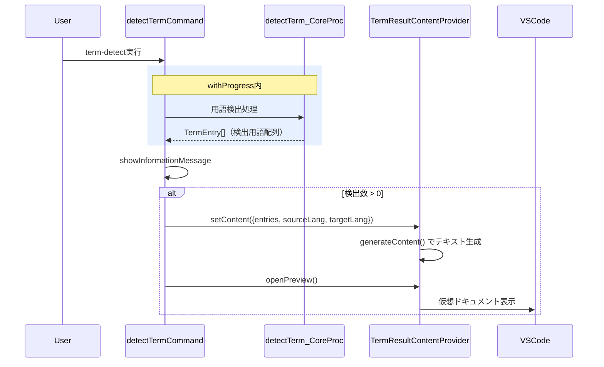

# チケット: term-detect結果プレビュー追加

## 1. 概要と方針

`term-detect` コマンド完了後、検出した用語一覧を仮想ドキュメントでプレビュー表示する機能を追加する。TM の `TmResultContentProvider` と同じパターン（シングルトン + 固定URI + `onDidChange` 上書き更新 + 純粋`generateContent`関数）を採用する。

## 2. 仕様

### 表示条件
- `term-detect` コマンド完了後、検出数 > 0 の場合にプレビューを自動表示
- 0件の場合は表示しない（既存の `showInformationMessage` 通知のみ）
- キャンセル時は途中までの検出結果があればプレビュー表示する

### 表示フォーマット

TM側の `"原文"\n  → "訳文"` インデント2行形式を踏襲し、`context:` 行を追加する。

```
# Term Detect Results - 2026-03-22 15:30

## Detected (5)
"API endpoint"
  → "APIエンドポイント"
  context: An endpoint that accepts HTTP requests

"configuration"
  (target not detected)
  context: Settings for configuration management
```

| ケース | 表示 |
|---|---|
| ソース+ターゲットあり | `"source"\n  → "target"\n  context: ...` |
| ソースのみ（ターゲットなし） | `"source"\n  (target not detected)\n  context: ...` |
| contextが空 | context行を省略 |
| 0件 | `(none)` |

## 3. シーケンス図



## 4. 設計

### 型定義

`TermDetectResult`（`term-result-provider.ts` で定義・エクスポート）:

```typescript
interface TermDetectResult {
  entries: readonly TermEntry[];
  sourceLang: string;
  targetLang: string;
}
```

`generateContent` の入力と `setContent` の引数に使用。`TermEntry` は既存の型をそのまま利用する（`context`, `languages[lang].term` を表示に使用）。

### 新規ファイル

| ファイル | 責務 |
|---|---|
| `src/commands/term/term-result-provider.ts` | `TermResultContentProvider`（シングルトン, `TextDocumentContentProvider`）+ `generateContent()` 純粋関数 + `TermDetectResult` 型定義 |
| `src/test/commands/term/term-result-provider.test.ts` | `generateContent()` のユニットテスト |

### 変更ファイル

| ファイル | 変更内容 |
|---|---|
| `src/commands/term/command-detect.ts` | `detectTerm_CoreProc` の戻り値を `Promise<void>` → `Promise<TermEntry[]>` に変更。末尾に `return allDetectedTerms;` 追加。`detectTermCommand` で返却値を受け取りプレビュー呼び出し |
| `src/extension.ts` | `TermResultContentProvider.getInstance()` の登録（スキーム `mdait-term-result`） |
| `docs/design/command_term.md` | コンポーネント表・シーケンス図にプレビュー追加 |

### 実装パターン

TM側 `TmResultContentProvider` と同一パターンを踏襲:
- シングルトン: `TermResultContentProvider.getInstance()`
- スキーム: `mdait-term-result`
- 固定URI: `mdait-term-result:term-detect-result`
- `setContent(result)` → `generateContent()` でテキスト生成 → `onDidChange` 発火（既存タブ再利用）
- `openPreview()` → `vscode.workspace.openTextDocument` + `showTextDocument`

### `detectTerm_CoreProc` の変更

変更は最小限:
- 戻り値型: `Promise<void>` → `Promise<TermEntry[]>`
- 関数末尾: `return allDetectedTerms;` を追加
- キャンセル時の `return;` → `return allDetectedTerms;`（途中結果を返却）

`detectTermCommand` 側の変更:
- `withProgress` の戻り値として `TermEntry[]` を受け取る
- `withProgress` 完了後、エントリ数 > 0 なら `setContent` → `openPreview` を呼び出す（`withProgress` の外で実行し、進捗UI終了後にプレビューを開く）

### `extension.ts` 登録

TM側の登録パターン（L206-209）と同じ形式で追加:
```
const termResultProvider = TermResultContentProvider.getInstance();
const termResultProviderDisposable = vscode.workspace.registerTextDocumentContentProvider(
    "mdait-term-result", termResultProvider);
```

## 5. 考慮事項

| 項目 | 判断 |
|---|---|
| `detectTerm_CoreProc` 戻り値変更の妥当性 | `allDetectedTerms` は既に内部で累積済み。`return` を追加するだけで、既存ロジックへの影響なし。呼び出し元は `detectTermCommand` のみ |
| ターゲット言語なしの表示 | `entry.languages[targetLang]` が存在しない場合は `(target not detected)` と表示。SOURCE_ONLYプロンプトで検出した場合に該当 |
| context表示 | `entry.context` が空文字の場合は context 行を省略。通常は LLM が context を生成するため空になることは稀 |
| キャンセル時の動作 | 途中結果を `allDetectedTerms` で返却し、検出済み分があればプレビュー表示。用語集への保存は途中結果が含まれる（既存動作を変えない） |
| 既存テストへの影響 | `detectTerm_CoreProc` を直接テストしているコードがなければ影響なし（型の変更のみ） |

## 6. 実装・テスト計画と進捗

- [x] `src/commands/term/term-result-provider.ts` — `TermDetectResult`型 + `TermResultContentProvider`クラス + `generateContent()`関数
- [x] `src/commands/term/command-detect.ts` — `detectTerm_CoreProc` 戻り値変更 + `detectTermCommand` プレビュー呼び出し追加
- [x] `src/extension.ts` — `TermResultContentProvider` スキーム登録
- [x] `src/test/commands/term/term-result-provider.test.ts` — `generateContent()` テスト（対訳あり/なし/0件/空context/特殊文字/タイムスタンプ）
- [x] `docs/design/command_term.md` — コンポーネント表・シーケンス図更新

## 7. 品質要件チェック

- [ ] 対訳ペアあり（source+target）で正しく表示される
- [ ] ソースのみ（target未検出）で `(target not detected)` が表示される
- [ ] context空の場合、context行が省略される
- [ ] 0件検出時はプレビューを開かない
- [ ] 特殊文字（`&`, `<`, `>`, `"` 等）を含む用語が正しく出力される
- [ ] `generateContent` のタイムスタンプが `YYYY-MM-DD HH:mm` 形式
- [ ] 既存テストが壊れていない
- [ ] TM側の表示フォーマットと統一感がある

## 8. まとめと改善提案

（作業完了後に記載）

## 9. 参考

- Wish: [tasks/wishlist.md](../wishlist.md) 「term-detect 結果プレビューの追加」
- TM側の実装パターン: `src/commands/tm/tm-result-provider.ts`
- TM側のコマンド呼び出し: `src/commands/tm/command-commit.ts` の `showTmCommitPreview()`
- TM側のテスト: `src/test/commands/tm/tm-result-provider.test.ts`
- Term検出のコア: `src/commands/term/command-detect.ts`
- Term型定義: `src/commands/term/term-entry.ts`
- TermEntry型: `src/commands/term/term-entry.ts`
