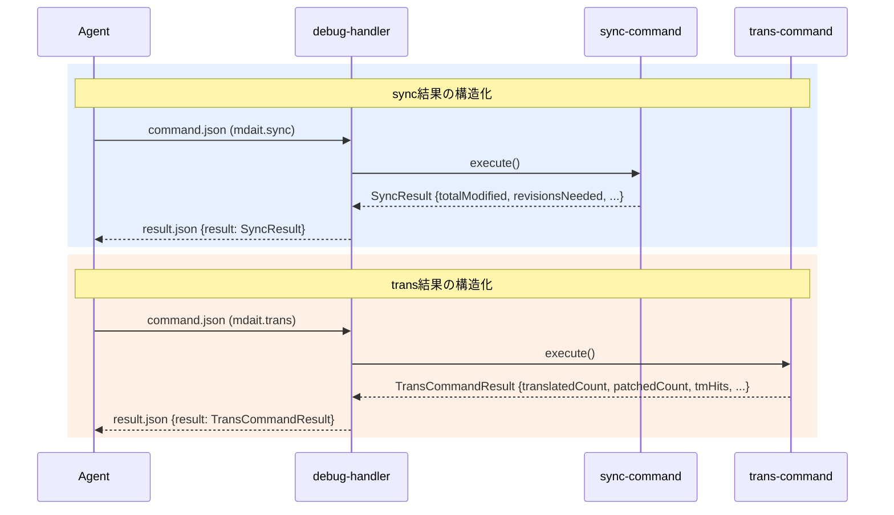

# 260328 - デバッグ可観測性改善

sync/transコマンドの戻り値を構造化し、patchMode不発の原因を特定・修正する。

## 背景
ファイルベースIPCによるデバッグ基盤は動作済みだが、sync/transがvoidを返すため構造化された結果でアサーションできない。tm.commitのみ結果オブジェクトを返している状態。今後の自律テスト設計の基盤として、コマンド結果の可観測性を高める必要がある。

## 方針
- sync/transコマンドに結果オブジェクトを導入し、debug-handlerの`result.json`に構造化データが載るようにする
- syncログに`revisionsNeeded`（need:revise付与件数）を追加し、`totalModified`との混同を解消する
- patchMode不発の原因を調査し、必要なら修正する

## 設計



### SyncResult

```typescript
interface SyncResult {
  totalFileCount: number;
  successCount: number;
  errorCount: number;
  totalAdded: number;
  totalModified: number;
  totalDeleted: number;
  totalUnchanged: number;
  revisionsNeeded: number; // need:revise付与件数（新規追加）
  durationMs: number;
}
```

### TransCommandResult

```typescript
interface TransCommandResult {
  unitCount: number;        // 処理unit数
  translatedCount: number;  // 実際に翻訳したunit数
  patchedCount: number;     // patchModeで翻訳したunit数
  skippedCount: number;     // スキップしたunit数
  tmHits: number;           // TM参照ヒット数
}
```

### patchMode不発の調査

patchModeの3条件（`trans-command.ts` L418）:
```typescript
const canPatch = unit.marker?.needsRevision() && previousTranslation && context.sourceDiff;
```

- `needsRevision()`: syncで`need:revise@{hash}`が付与されているか
- `previousTranslation`: `unit.content`が存在するか（`unit.marker?.from`がtruthyのとき）
- `sourceDiff`: `unitRegistry`から旧ソースを引いてdiffが生成できるか

最も怪しいのは`sourceDiff`。`loadUnitRegistry(oldhash)`で旧hashのコンテンツが取れない場合、diffが生成されずpatchModeが不発になる。

## 考慮事項
- sync/transのvoid→結果オブジェクト変更は、呼び出し元（extension.ts, debug-handler等）の型にも影響する
- 既存のログ出力は維持し、結果オブジェクトは追加。ログの削除はしない
- patchMode不発がunit-registry起因の場合、registryの保存タイミングを確認する必要がある

## TODO
- [x] SyncResult型を定義し、sync-command.tsが結果オブジェクトを返すように変更
- [x] SyncResultに`revisionsNeeded`を追加（marker-sync.tsからカウントを返す）
- [x] TransCommandResult型を定義し、trans-command.tsが結果オブジェクトを返すように変更
- [x] patchMode不発の原因調査（unit-registryの旧hash保存状況を確認）
- [x] patchMode不発の修正（原因に応じて）→ 修正不要（下記備考参照）
- [x] 既存テストの修正（戻り値型変更に伴う）→ 修正不要

## 品質要件
- [x] 既存のvitest単体テストが全てパスすること
- [ ] debug-ipcでsync実行時にresult.jsonにSyncResultが載ること
- [ ] debug-ipcでtrans実行時にresult.jsonにTransCommandResultが載ること
- [ ] syncでソース変更後re-sync時にrevisionsNeeded > 0になること

## まとめ
sync/transコマンドに構造化された結果オブジェクト（`SyncResult`/`TransCommandResult`）を導入した。debug-handlerの`result.json`にそのまま載る。patchModeのロジック自体に不具合はなく、診断ログを強化した。

第2弾として、実際のバグ（空ファイルsync時のENOENT）を使って自律デバッグの仕組みを評価し、3件の改善を実施:
- `done-with-errors`ステータス（errorCount > 0の部分失敗検知）
- `structuredLogs`フィールド（level/scope/message/context/timestampの構造化ログ）
- 診断ログ強化（スキップ理由、targetファイル未作成時のガードログ）

## 備考
- 本チケットは「デバッグ環境の強化」wishの前半部分。後半の「自律テスト設計」は別チケットとしてwishlistに残置。
- transの戻り値にはtermSuggestionsやwarningsは含めない（デバッグ用メトリクスに絞る）。

### patchMode不発の調査結果

コードトレースの結果、patchModeの3条件（`needsRevision`, `previousTranslation`, `sourceDiff`）を満たすためのデータフローに構造的な欠陥は見つからなかった。

1. **`needsRevision()`**: `syncMarkerPair`でソース変更検出時に`need:revise@{oldSourceHash}`が正しく設定される。
2. **`previousTranslation`**: `unit.marker.from`がtruthy（翻訳済みターゲット）のとき`unit.content`が前回訳文として取得される。
3. **`sourceDiff`**: `loadUnitRegistry(oldhash)`は、初回sync時に`syncNew_CoreProc`で保存されたスナップショットから旧ソースを取得できる。`sync_CoreProc`でも毎回最新ソースのスナップショットを保存しており、タイミング的にも問題ない。

**結論**: patchModeのロジック自体は正常に動作するはず。不発が観測された場合の原因として、以下の可能性がある:
- デバッグシナリオでsyncを経由せずにターゲットファイルを作成した（unit-registryにスナップショットが存在しない）
- `UnitRegistryManager`のシングルトンがリセットされた

診断ログを強化（`loadUnitRegistry`の結果をDEBUGレベルで出力）し、今後の再現調査に備えた。
