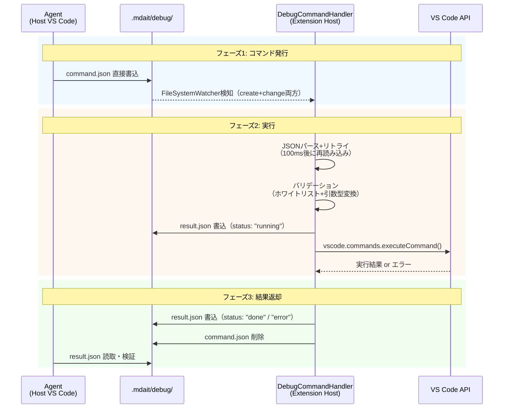

# 260328 - デバッグ環境ファイルベースIPC（エージェント自律テスト基盤）

Extension Hostデバッグ起動中にファイルベースIPCでエージェントからmdaitコマンドを発行・結果確認できる仕組みを作る。

## 背景

mdaitのマルチステップ統合シナリオ（sync → trans → TM登録 → 改訂 → re-sync → re-trans → 用語集/TMがプロンプトに正しく渡されるか確認、など）は人間が手動でデバッグ実行して目視確認している。エージェントが自律的にこれを行える環境がない。ユニットテストではLLM呼び出し不可、GUIテストも基本LLMモック。

## 方針

- Extension Host側にdebug時のみ有効な `DebugCommandHandler` を追加
- `.mdait/debug/command.json` をFileSystemWatcherで監視し、コマンド検知で `vscode.commands.executeCommand()` を実行
- 結果を `.mdait/debug/result.json` に書き出す
- エージェント（ホスト側VS Code）はファイル操作 + IPCでmdaitを操作し、結果ファイルを読んで検証する
- LLMはvscode-lm（Copilot）経由で実際に呼び出す

## 設計

### 全体方針

Extension Host内に**debug時のみ有効化**される `DebugCommandHandler` を1クラスで実装する。ファイル監視・コマンド実行・結果出力をこのクラスに閉じ込め、`extension.ts`からの初期化を1行で完結させる。

### シーケンス図



### 有効化の仕組み

`launch.json`の`env`に環境変数`MDAIT_DEBUG_IPC=1`を追加する。`activate()`内で`process.env.MDAIT_DEBUG_IPC`を判定し、設定されている場合のみ`DebugCommandHandler`を生成・登録する。

- 環境変数方式を選択する理由: リリースバイナリには一切の痕跡が残らず、launch.json側で制御が完結する。VS Code設定値やコンテキスト変数はユーザーが誤って有効化するリスクがある
- `--profile-temp`との相性: 環境変数はプロファイルに依存しないため、一時プロファイルのデバッグ起動でも確実に動作する

```jsonc
// .vscode/launch.json への追記
"env": { "MDAIT_DEBUG_IPC": "1" }
```

### DebugCommandHandler クラス設計

**配置**: `src/debug/debug-command-handler.ts`

**責務**: ファイル監視 → バリデーション → コマンド実行 → 結果出力を一貫して処理する。責務の過剰分離はしない。

**ライフサイクル**:
- `constructor(workspaceRoot: string)`: debugディレクトリ作成、FileSystemWatcher登録
- `dispose()`: Watcher解放、debugディレクトリのクリーンアップ

**内部処理フロー**:
1. `FileSystemWatcher`で`.mdait/debug/command.json`の作成・変更を監視（`onDidCreate` + `onDidChange` 両方）
2. ファイル検知時にJSONパースを試みる。パース失敗時は100ms後にリトライ（Agent直接書き込み時の部分読み取り対策）
3. パース成功後、バリデーション実行（ホワイトリスト + 必須フィールド）
4. 即座に`result.json`を`status: "running"`で書き出し（Agentが実行開始を検知可能に）
5. **引数型変換**: コマンドに応じてargs内の文字列パスをvscode.Uri等に変換
6. `vscode.commands.executeCommand()`でコマンド発行
7. 結果を`result.json`に`status: "done"` or `"error"`で上書き
8. 処理済みの`command.json`を削除（次のコマンドを受け付けるため）

**引数型変換マップ**: Handler内にコマンドごとの変換ロジックを持つ。Agentは常に文字列パスを渡せばよい。
- `mdait.trans` / `mdait.translate.frontmatter` → 第1引数を `vscode.Uri.file(path)` に変換
- `mdait.translate.file` / `mdait.tm.commit.file` → 第1引数を `{ filePath: absolutePath }` に変換
- `mdait.translate.directory` / `mdait.tm.commit.directory` → 第1引数を `{ directoryPath: absolutePath }` に変換
- その他（sync等） → 変換なし

**コマンドホワイトリスト**: `mdait.`プレフィックスを持つコマンドのみ実行を許可する。それ以外は`status: "error"`で即時拒否。

### command.json スキーマ

```json
{
  "id": "uuid-v4",
  "command": "mdait.sync",
  "args": []
}
```

| フィールド | 型 | 説明 |
|---|---|---|
| `id` | `string` | コマンド実行のリクエストID（UUID v4）。Agent側で生成し、result.jsonとの対応付けに使用 |
| `command` | `string` | VS Codeコマンド名（`mdait.*`のみ許可） |
| `args` | `unknown[]` | `executeCommand()`に渡す引数配列。省略時は空配列 |

### result.json スキーマ

```json
{
  "id": "uuid-v4（command.jsonのidと同一）",
  "command": "mdait.sync",
  "status": "done",
  "result": null,
  "error": null,
  "logs": ["[INFO] ..."],
  "startedAt": "2026-03-28T12:00:00.000Z",
  "completedAt": "2026-03-28T12:00:05.123Z"
}
```

| フィールド | 型 | 説明 |
|---|---|---|
| `id` | `string` | リクエストID |
| `command` | `string` | 実行したコマンド名 |
| `status` | `"running" \| "done" \| "error"` | 実行状態 |
| `result` | `unknown \| null` | `executeCommand()`の返り値 |
| `error` | `string \| null` | エラー時のメッセージ |
| `logs` | `string[]` | 実行中にLoggerが出力したログ行（デバッグ用） |
| `startedAt` | `string` | 実行開始のISO 8601タイムスタンプ |
| `completedAt` | `string \| null` | 実行完了のISO 8601タイムスタンプ。`running`中は`null` |

### ログキャプチャ（第2マイルストーン）

`result.json`の`logs`フィールドにコマンド実行中のログを含める。`DebugCommandHandler`がコマンド実行前にLoggerにリスナーを登録し、実行後に取り外す。Loggerに既存のリスナー機構がない場合、軽量な`onLog`コールバック配列を追加する（OutputChannel出力とは独立）。

初回マイルストーンでは`logs`は空配列を返し、Logger改修は後続で行う。

### 書き込み方式

**Agent（書き込み側）**: `command.json`を`create_file`で直接書き込む（rename方式は不採用。エージェントのツールでrenameは不自然で手数が増えるため）。Handler側がパースリトライで部分読み取りに対応する。

**Handler（読み取り側）**: ファイル検知後にJSONパースを試みる。パース失敗または必須フィールド欠損の場合は100ms後にリトライ（最大3回）。これにより書き込み途中のファイルを安全に処理できる。

**Handler（書き込み側）**: `result.json`は直接書き込み。Agentは`status`フィールドが`"done"`または`"error"`になるまでポーリング待機する。Agent側もJSONパースエラー時はリトライする。

**パースエラー時のresult.json**: command.jsonのパースに完全に失敗した場合は `{ "id": null, "status": "error", "error": "Invalid command.json" }` を書き出す。

### ポーリングヘルパー

Agent側のポーリングを効率化するため、PowerShellワンライナーで待機する：
```powershell
while (-not (Test-Path .mdait/debug/result.json) -or ((Get-Content .mdait/debug/result.json -Raw | ConvertFrom-Json).status -eq 'running')) { Start-Sleep -Milliseconds 500 }; Get-Content .mdait/debug/result.json -Raw
```
Agentは`run_in_terminal`でこのワンライナーを実行し、完了時にresult.jsonの内容を一発で取得できる。

### 排他制御

コマンドは1つずつ逐次実行する。`command.json`が存在する間は次のコマンドを受け付けない（Handlerが処理完了後に`command.json`を削除するため、次のコマンドは削除後にのみ書き込まれる前提）。Agent側はresult.jsonの`status`が`"done"`/`"error"`になるのを確認してから次のcommand.jsonを書き込む。

### extension.ts での初期化

```
// activate()内、logger.info("extension", "mdait extension activated successfully") の直前に挿入
if (process.env.MDAIT_DEBUG_IPC) {
    const wsRoot = vscode.workspace.workspaceFolders?.[0]?.uri.fsPath;
    if (wsRoot) {
        const { DebugCommandHandler } = await import("./debug/debug-command-handler");
        const debugHandler = new DebugCommandHandler(wsRoot);
        context.subscriptions.push(debugHandler);
        logger.info("debug", "DebugCommandHandler activated (IPC mode)");
    }
}
```

- **動的import**: debugモジュールはdebug時のみロードされ、通常起動時はモジュール解決すら行わない
- **context.subscriptions**: Disposableとして登録し、拡張deactivate時に自動解放
- **wsRoot guard**: ワークスペースが開かれていない場合は無視

### ファイル配置

```
src/
  debug/
    debug-command-handler.ts   # DebugCommandHandler本体
```

テスト不要（この仕組み自体がテスト基盤であるため、循環的な自己テストは価値がない）。

### .gitignore 更新

`DebugCommandHandler`のコンストラクタ内で`.mdait/debug/.gitignore`に`*`を書き出す（debugディレクトリ全体をgit管理外に）。`ensureMdaitDir()`には手を加えない（debug固有のロジックを汎用関数に入れない）。

### launch.json 更新

```jsonc
{
  "name": "Run Extension",
  // ... 既存設定 ...
  "env": {
    "MDAIT_DEBUG_IPC": "1"
  }
}
```

## 考慮事項

- `--profile-temp` でのデバッグ起動でvscode-lm APIが使えることは確認済み
- リリースビルドへの影響を排除すること（debug時のみ有効化）
- コマンド実行の安全性（意図しないデータ破壊の防止）
- ファイルウォッチャーのタイミング（書き込み中の読み取り防止）
- result.jsonへの書き出しフォーマット（成功/失敗/ログ）

## TODO
- [x] m.architectによる設計
- [x] 設計レビュー（m.researcher + m.customer）
- [x] m.coderによる実装（最小スコープ: syncコマンドのIPC実行・結果確認）
  - [x] `src/debug/debug-command-handler.ts` 作成
  - [x] `extension.ts` に環境変数判定と動的import追加
  - [x] `launch.json` にenv追加
  - [x] `.mdait/debug/.gitignore` 自動生成
- [x] m.reviewerによるレビュー（条件付き承認→引数変換修正済み）
- [ ] m.coderによる実装（第2マイルストーン: ログキャプチャ）
  - [ ] LoggerにonLogコールバック機構追加
  - [ ] DebugCommandHandlerでログキャプチャ実装

## 品質要件
- [x] debug時のみ有効であること（環境変数MDAIT_DEBUG_IPC判定 + 動的import）
- [x] コマンド実行→結果返却の基本フローが動作すること
- [x] syncコマンドがIPCで実行でき、結果が確認できること
- [x] 既存テスト（unit/gui）が壊れないこと（283 passing）

## まとめ
エージェントが自律的にmdaitの統合シナリオをテストするための「ファイルベースIPC」基盤を実装した。Extension Hostデバッグ起動中に`.mdait/debug/command.json`にコマンドを書き込むと、DebugCommandHandlerがFileSystemWatcherで検知し、`vscode.commands.executeCommand()`で実行、結果を`result.json`に書き出す。環境変数`MDAIT_DEBUG_IPC=1`でのみ有効化される動的importにより、リリースビルドへの影響はゼロ。レビューで指摘された引数型変換の不整合（StatusItemのtype/プロパティ名）も修正済み。ログキャプチャは第2マイルストーンとして残している。

## 備考
- wishlistからの転記: エージェント自律テスト基盤（デバッグ環境ファイルベースIPC）
