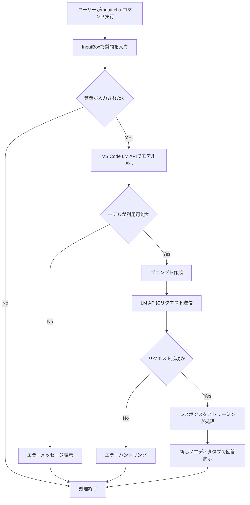

# 作業チケット: chatコマンドの設計と実装

## 1. 概要と方針

VS Code Language Model API を組み込んだ最小限の `chat` コマンドを実装し、mdait プロジェクトで LM API の使用方法に慣れることを目的とします。既存の `sync` と `trans` コマンドに加えて、新しく `chat` コマンドを追加し、ユーザーの質問に回答する機能を提供します。

**方針**:
- 実装は最小限に留め、API の動作確認と学習に重点を置く
- 既存のプロジェクト構造に合わせて `commands/chat/` ディレクトリに実装
- エラーハンドリングを適切に行い、ユーザーに分かりやすいフィードバックを提供

## 2. 主な処理フロー

## 3. 主要関数・モジュール

### ChatCommand クラス
- `execute()`: メインの処理フロー
- `getUserInput()`: ユーザーからの質問入力を取得
- `selectLanguageModel()`: 適切な言語モデルを選択
- `createPrompt()`: 言語モデル用のプロンプトを作成
- `sendRequest()`: 言語モデルにリクエストを送信
- `displayResponse()`: 回答を新しいエディタタブで表示

### ファイル構成
- `src/commands/chat/chat-command.ts`: ChatCommand クラスの実装
- `src/extension.ts`: コマンド登録の追加

## 4. 考慮事項

- **ユーザー同意**: Copilot の言語モデルはユーザーの同意が必要なため、適切なエラーハンドリングを実装
- **レート制限**: API の使用頻度制限を考慮し、適切なエラーメッセージを表示
- **モデル可用性**: 指定されたモデルが利用できない場合の代替処理
- **ストリーミング応答**: レスポンスがストリーミングベースのため、適切な処理を実装
- **既存コード**: 既存のプロジェクト構造やコーディングスタイルに合わせる

## 5. 実装計画と進捗

- [x] `src/commands/chat/chat-command.ts` の基本構造を作成
- [x] VS Code Language Model API の基本的な使用方法を実装
- [x] InputBox でユーザー入力を取得する機能を実装
- [x] 言語モデルの選択とリクエスト送信機能を実装
- [x] ストリーミングレスポンスの処理を実装
- [x] 新しいエディタタブでの回答表示機能を実装
- [x] エラーハンドリングの実装
- [x] `src/extension.ts` にコマンド登録を追加
- [x] `package.json` にコマンド定義を追加
- [x] 基本的なテストケースの作成

## 6. 実装メモ・テスト観点

### 実装完了事項
- **VSCodeLanguageModelProvider**: VS Code Language Model API を AIService インターフェースでラップ
- **ChatCommand のシンプル化**: 直接的な LM API 呼び出しを削除し、AIService 経由に変更
- **AIServiceBuilder の拡張**: "vscode-lm" プロバイダーをサポート
- **関心の分離**: チャット機能とLM API の詳細実装を分離

### アーキテクチャの改善
- **Before**: ChatCommand → 直接 VS Code LM API
- **After**: ChatCommand → AIService → VSCodeLanguageModelProvider → VS Code LM API

### テスト観点
- ユーザー入力のキャンセル時の適切な処理
- AIServiceBuilder による適切なプロバイダー選択
- エラーハンドリングの委譲が正しく動作すること
- ストリーミングレスポンスの正常な表示

### 動作確認方法
1. VS Code でプロジェクトを開く
2. F5 でデバッグ実行
3. コマンドパレット（Ctrl+Shift+P）で `mdait: チャット` を実行
4. 質問を入力して回答が表示されることを確認

### コードの改善点
- ChatCommand が約80行 → 約50行に削減
- VS Code 固有のロジックを VSCodeLanguageModelProvider に分離
- 将来的に他の LM プロバイダー追加時の拡張性向上

## 7. 次のステップ

- 基本実装完了後、より高度な機能（コンテキスト情報の追加、複数の回答形式のサポート等）の検討
- 実際の翻訳機能との統合可能性の検討
