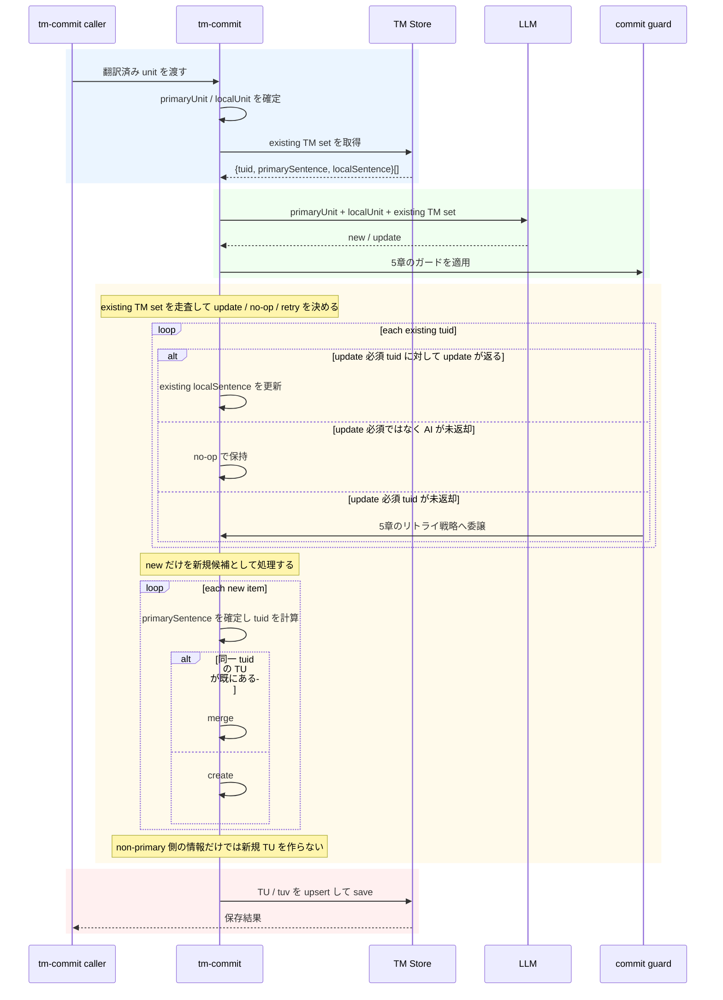
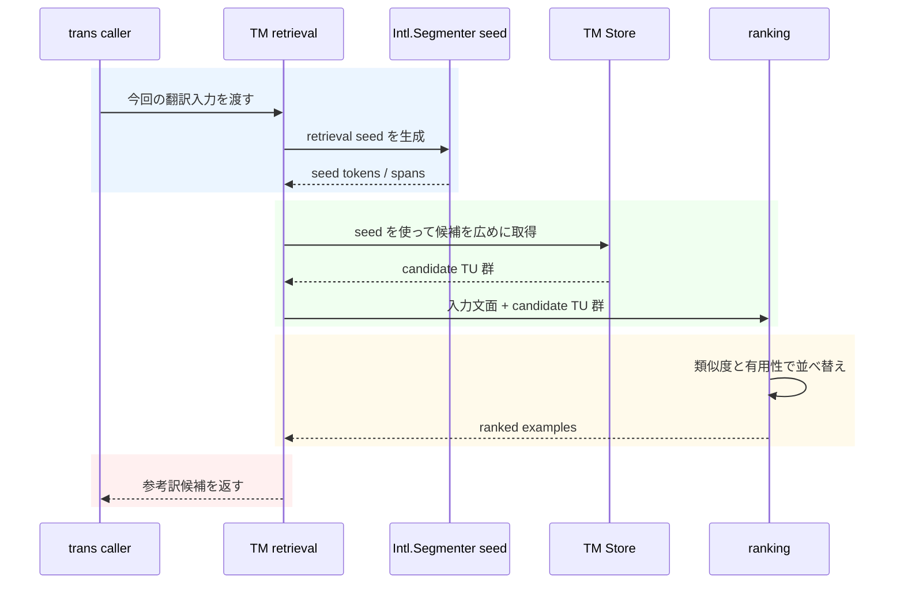

# mdait TM 概念設計メモ

TM を primaryLang 基準の翻訳資産として保存し、翻訳前には類似例 retrieval に使うためのガードレール文書。

## 1. 文書の役割

- これは詳細設計書ではなく、再設計で破ってはいけない判断軸を固定するためのメモである
- 現行実装は sourceLang / sentenceHash 中心の構造を含むが、この文書は future-facing な基準を示す
- 対象は保存側、参照側、改訂時の責務分離であり、実装都合による一時的な互換レイヤは前提にしない

## 1.5 最小用語集

- TU: 翻訳単位。1 つの primary sentence と、その各言語の文をまとめて持つ箱
- tuv: TU の中の各言語の文。primary の tuv がない TU は有効と見なさない
- primaryLang: この文書で正準とする基準言語。識別子や保存判断はこの文面を軸にする
- local: primary 以外の言語。sourceLangのこともあればtargetLangのこともある。TM 登録の文脈ではsource/targetではなく、primary/localの対比で考える
- localized / additions: 前者は既存 tuid への対応付け、後者は existing TM set では表せない新規追加候補
- upsert / retrieval: upsert は「既存なら更新、なければ作成」、retrieval は「参考訳を探すこと」で、candidate generation と ranking の二段階で考える

## 2. コア原則

- 基準はprimaryLang である
- 1 TU = 1 primary sentence として扱う
- tuid = hash(norm(primary_sentence)) を正準の識別子とする
- 保存側と参照側は別責務として設計する
- sentence segmentation を真に担うのは tm-commit だけである
- 参照側の目的は translation example retrieval である
- retrieval は candidate generation と ranking の二段階で考える
- Intl.Segmenter は retrieval seed 用の補助であり、truth-maker ではない

## 3. 保存側の不変条件

- TU は primary sentence を軸に成立し、primary の tuv を持たない TU は有効と見なさない
- 新規 TU を作ってよいのは primary sentence を確定できたときだけである
- non-primary 側の情報だけを根拠に新規 TU を作らない
- changed unit は sentence 集合に変化があり得ることを示すだけで、一括削除や一括再作成の根拠にはならない
- 保存側の正準キーは pair 相対の sourceLang ではなく primary sentence である

## 4. tm-commit の責務

tm-commit は、翻訳済み unit から TM に登録する primary sentence 集合を確定し、既存 TU への局所更新と新規追加を分離したまま upsert する責務を持つ。

### 4.1 LLMへの入力

- primaryUnit : primaryLangの翻訳ユニットの原稿
- localUnit : localLangの翻訳ユニットの原稿
- existing TM set : primary sentence を軸にした既存 TU の集合。
  - tuid (primary sentence hash)
  - primarySentence
  - localSentence


### 4.2 LLMからの出力

- type : new / update のいずれか
  - new : existing TM set にはない新しい primary / local の追加候補
  - update : existing TM set のlocalに対して、 localUnitが更新されており、localの更新が必要と判断 ( 新規localizeの場合とlocal文の更新の場合がある )
- tuid : primary sentence hash を tuid として返す。new の場合は未計算なので "-" を返す
- primary : primaryLangの文面。必ずprimaryUnitの文面のサブセットであるべき
- local : localLangの文面。必ずlocalUnitの文面のサブセットであるべき

```json
{
  [
    {
      "type": "new",
      "tuid": "-",
      "primary": "This is a new example.",
      "local": "これは新しい例です。"
    },
    {
      "type": "update",
      "tuid": "i9j0k1l2",
      "primary": "This is an existing example that needs update.",
      "local": "これは既存の例ですが、更新が必要です。"
    }
  ]
}
```

### 4.3 守るべき規則

- primary / local に改行は含まれないべきである。（翻訳メモリの粒度は sentence 単位であるべき）
- primary / local は1つの文であるべきで、複数文は含まれないべきである。これはLLMへの強力な指示により達成すべき。
- primary / local は単語・熟語・意味をなさないフレーズであってはならない。TMとして意味のある文であるべきで、LLMへの指示でこれも達成すべき。
- update が必要な既存 tuid 群は、LLM が必ず type=update で返すべきである
- update 必須の既存 tuid が欠落した応答は no-op で吸収せず、5章のガード違反として扱う
- additions では LLM出力後に tuid を計算する

## 5. TM登録のガードとリトライ戦略

tm-commit では、LLM 応答の欠落や形式崩れを no-op で吸収しない。
他機能で用いている JSON スキーマ検証や再試行と同等のガードを水平展開し、TM登録でも fail-closed に寄せる。

### 5.1 ガード対象

- 応答は JSON スキーマに適合しているべきである
- primary / local は 4.3 の規則を満たすべきである
- existing TM set のうち update 必須として入力で明示した tuid 群は、LLM が漏れなく type=update で返すべきである
- update 必須 tuid の欠落、subset 違反、文粒度違反はすべてガード違反として扱う

### 5.2 プロンプト契約

- LLM には primaryUnit / localUnit / existing TM set に加えて、update 必須 tuid 一覧を渡す
- この一覧は参考情報ではなく制約であり、該当 tuid を省略した応答は不正と明示する
- 再試行時には、欠落していた tuid や違反理由を明示して再送する

### 5.3 リトライ戦略

- 1回目の応答がガード違反なら、違反理由を添えて再試行する。
- 再試行では欠落tuidのローカル補完のみを行うように指示する。（収集済みの正常応答は再送せず、欠落のみにフォーカスして成功率を上げる）
- 再試行でもガード違反なら、上限回数まで同じ契約を維持して再送する
- 上限到達後も満たせない場合は、tm-commit自体は継続するが、該当tuid更新は行わず警告ログを出す
- cleanup や retrieval はこのリトライ戦略を持たず、TM登録だけがこのガードを持つ

## 6. sync時のcleanup

tm-commitでTMが構築されていくが、sync時には不要なユニットの削除（cleanup）を行う必要がある。
※この章の内容はcommitとは切り離すことが可能なので、実装時に別々の作業として分けて取り組む。

### 6.1 sync

- syncにより、unit の changed / added / removed を判定し蓄積しておく
- post sync処理として、unit-registry更新とともにTM cleanupを呼び出す。
  - 蓄積しておいた changed / added / removed 情報を渡す。primaryLangのものだけでよい

### 6.2 cleanup

cleanup は obsolete 候補を除去する責務を持つが、判定は二段階に分ける。

1. candidate extraction
   primary tuv が持つ unit 情報から削除候補を抽出する
2. actual sentence check
   候補 TU の primary seg が現在の primary 原稿に実在するかを照合する

最終判定軸は unit-hash ではなく primary sentence の現存性である。

### 6.3 境界の意味

- sync は unit レベルまで
- cleanup は old を落とすまで
- tm-commit は new を登録するまで

この境界を混ぜない。

短い例として、v1 に sentence A / B / Cがあり、v2 で A は残存・B は文面改訂・Cはローカル側のみ修正・ Dが追加された場合を考える。

- sync は「その unit が changed した」ことだけを出す
- cleanup は旧 B が現行 primary 原稿にもう存在しないと確定できたときだけ obsolete 候補として落とす
- tm-commit は v2 の B と D を sentence segmentation し、既存 TU へ new として登録する。Cは local側のみ更新されているため update として更新する

## 7. 翻訳時の参照の原則

※本章の内容はcommitとは切り離すことが可能なので、実装時に別々の作業として分けて取り組む。

- 参照側は保存側の主キーをそのまま lookup するための機能ではない
- 目的は「今回の入力に似ていて訳の参考になる過去例」を返すことである
- 入口はその翻訳で今扱っている言語の文面でよく、primaryLang 固定である必要はない
- retrieval は広めに候補を集める candidate generation と、有用性順に並べる ranking を分けて設計する
- exact match は使ってよいが中心思想にしない

## 8. シーケンス図

8章では、4章から7章で分離した責務に合わせて、TM登録・sync時cleanup・trans時参照をそれぞれ独立した図で示す。
tm-commit は new / update の登録と 5章のガード適用、cleanup は obsolete 候補の削除判定、retrieval は参考例の検索と順位付けだけに責務を限定して読む。

### 8.1 TM登録

図は、existing TM set の再利用判定、AI が返した new / update の解釈、5章のガード判定、最後の upsert の順に読む。
既存再利用は update / no-op / retry、新規側は create / merge にだけ進む。



### 8.2 sync時のcleanup

図は、sync が unit レベルの変化を蓄積し、その後 cleanup が primary sentence の現存性だけで obsolete 候補を判定する流れを示す。
sync は changed / added / removed を出すだけで、削除可否の最終判断は cleanup が担う。

```mermaid
sequenceDiagram
  participant Caller as sync caller
  participant Sync as sync
  participant Registry as unit-registry updater
  participant Cleanup as TM cleanup
  participant Store as TM Store
  participant Source as current primary source

  rect rgb(235,245,255)
    Caller->>Sync: ファイル同期を実行
    Sync->>Sync: unit の changed / added / removed を判定
    Sync->>Registry: unit-registry を更新
    Registry-->>Sync: 更新完了
  end

  rect rgb(240,255,240)
    Sync->>Cleanup: primaryLang の changed / added / removed を渡す
    Cleanup->>Store: 候補 TU を取得
    Store-->>Cleanup: primary tuv と unit 情報
    Cleanup->>Cleanup: candidate extraction
  end

  rect rgb(255,250,235)
    loop each candidate TU
      Cleanup->>Source: current primary 原稿を確認
      Source-->>Cleanup: sentence の現存有無
      alt primary sentence が現存する
        Cleanup->>Cleanup: keep
      else
        Cleanup->>Cleanup: obsolete と判定
      end
    end
  end

  rect rgb(255,240,240)
    Cleanup->>Store: obsolete 候補だけを削除
    Store-->>Caller: cleanup 結果
  end
```



### 8.3 trans時の参照

図は、翻訳対象の文面から広めに候補を集め、その後 ranking で有用性順に並べて参考例を返す流れを示す。
ここでの責務は retrieval だけであり、保存側の主キー lookup や sentence segmentation の真偽判定は行わない。


