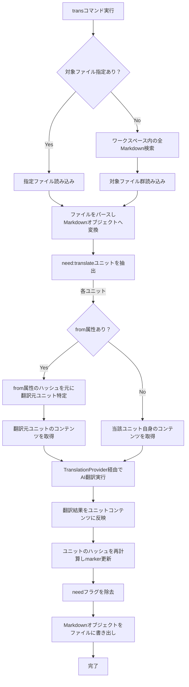

# 作業チケット: transコマンドの設計と実装

## 1. 概要と方針

`trans` コマンドは、指定されたMarkdownファイル内、またはワークスペース内の全Markdownファイルを対象に、`need:translate` フラグが付与されたユニットをAI翻訳し、翻訳結果を反映させる機能を提供します。

**設計方針:**
- `design.md` の「4.2 transコマンド」の記載に基づき実装
- 翻訳対象は `need:translate` フラグを持つユニットのみ
- AI翻訳処理は `src/api` の `AIService` インターフェースを経由
- `AIServiceBuilder` による設定ベースのプロバイダ選択
- 初期実装では `default` プロバイダのみサポート
- コードブロックスキップは設定 (`mdait.trans.markdown.skipCodeBlocks`) で制御

## 2. 主な処理フロー

## 3. 主要関数・モジュール

**コマンド実行層:**
- `src/commands/trans/trans-command.ts`
  - `executeTransCommand(targetPath?: vscode.Uri)`: コマンドエントリーポイント
  - `translateFile(filePath: string, aiService: AIService)`: 単一ファイル処理
  - `translateUnit(unit: MdaitUnit, aiService: AIService, sourceContent?: string, context: TranslationContext)`: ユニット翻訳

**翻訳処理層:**
- `src/commands/trans/translation-provider.ts`
  - `TranslationProvider`: AI翻訳の抽象化インターフェース
  - `translate(text: string, sourceLang: string, targetLang: string, context: TranslationContext): Promise<string>`
- `src/commands/trans/translation-context.ts`
  - `TranslationContext`: 翻訳コンテキスト（前後のテキスト、用語集等）

**AIサービス層:**
- `src/api/ai-service.ts`: `AIService`インターフェース、`AIMessage`、`MessageStream`型
- `src/api/ai-service-builder.ts`: 設定ベースの`AIService`生成
- `src/api/providers/default-ai-provider.ts`: デフォルトAIプロバイダ実装

## 4. 考慮事項

- **エラーハンドリング**: ファイル読み書きエラー、翻訳APIエラーの適切な処理
- **進捗表示**: 大量ファイル処理時のユーザーフィードバック
- **設定参照**: `mdait.trans.provider`, `mdait.trans.markdown.skipCodeBlocks`の適切な読み込み
- **言語指定**: 翻訳ペア設定 (`mdait.transPairs`) を参照した言語決定ロジック
- **Markdownパース**: `need:translate`ユニットの正確な特定と処理
- **ハッシュ整合性**: 翻訳後のユニットハッシュ更新とフラグ除去

## 5. 実装計画と進捗

- [x] `AIService`インターフェース設計と基本型定義
- [x] `AIServiceBuilder`による設定ベースプロバイダ生成
- [x] `DefaultAIProvider`実装（モック翻訳機能）
- [x] `TranslationContext`クラス実装
- [x] `TranslationProvider`インターフェースと実装
- [x] `trans-command.ts`でのVSCodeコマンド実装
- [x] `extension.ts`での基本コマンド登録
- [x] Markdownパーサーとの統合（`need:translate`ユニット特定）
- [x] `MdaitUnit`と`MdaitMarker`での翻訳フラグ管理
- [x] from属性による翻訳元ユニット特定機能
- [x] 翻訳後のハッシュ更新とneedフラグ除去
- [x] Markdownファイルの読み込み・パース・保存フロー
- [x] 基本的なユニットテストの実装
- [ ] `TranslationContext`への具体的情報設定ロジック（前後テキスト、用語集）
- [ ] 実際のAIプロバイダ（OpenAI等）との接続
- [ ] 言語ペア設定に基づく翻訳言語決定
- [ ] エラーハンドリングの強化
- [ ] 進捗表示機能の実装
- [ ] 複数ファイル対応（ワークスペース全体の翻訳）

## 6. 実装メモ・テスト観点

### 実装メモ
**設計変更点:**
- **VSCodeコマンド形式**: 当初`commander`パッケージ使用予定でしたが、VSCode拡張として`vscode.commands.registerCommand`を使用
- **`AIService`ストリーミング**: `MessageStream`として`AsyncIterable<string>`採用、ストリーミング応答処理に対応
- **設定読み込み**: `Configuration`クラスでVSCode設定を統合的に管理

**実装工夫点:**
- **コードブロックスキップ**: `TranslationProvider`内でプレースホルダー置換による翻訳除外処理
- **モジュラー設計**: AI層、翻訳層、コマンド層の明確な分離
- **設定ベースプロバイダ**: `AIServiceBuilder`による柔軟なプロバイダ切り替え
- **ユニット単位翻訳**: `markdownParser.parse()`によりファイル全体をユニットに分割、`unit.needsTranslation()`で翻訳対象を特定
- **フロー統合**: ファイル読み込み→パース→翻訳対象抽出→翻訳→ハッシュ更新→ファイル保存の完全なフロー実装

### 残課題
- **`TranslationContext`**: `surroundingText`、`glossary`設定ロジック未実装（現在は空のコンテキスト）
- **実AIプロバイダ**: OpenAI、Anthropic等の実際のAPI接続
- **エラー分類**: 詳細なエラーハンドリングと分類処理
- **複数ファイル対応**: ワークスペース全体翻訳のためのファイル検索・バッチ処理
- **言語ペア自動判定**: 設定から翻訳言語ペアを自動決定する機能

### テスト観点
- **ユニット翻訳**: `need:translate`フラグ識別と翻訳処理 ✅ 実装済み
- **ハッシュ更新**: 翻訳後のハッシュ再計算とフラグ除去 ✅ 実装済み  
- **設定反映**: コードブロックスキップ設定の動作確認 ✅ 実装済み
- **from属性処理**: 翻訳元ユニット特定とコンテンツ取得 ✅ 実装済み
- **フロントマター保持**: 翻訳処理後のフロントマター保持確認 ✅ 実装済み
- **エラーハンドリング**: ファイル読み書き、API呼び出しエラー処理 ⏳ 基本実装済み、詳細化必要
- **ストリーミング**: AI応答のストリーミング処理 ⏳ インターフェース準備済み、実プロバイダ接続待ち

## 7. 次のステップ

### 最優先（P0）
1. **実AIプロバイダ実装**: OpenAI API等の実際のAIサービス接続（Defaultプロバイダから移行）
2. **複数ファイル対応**: ワークスペース全体のMarkdownファイル翻訳機能

### 高優先（P1）
3. **`TranslationContext`詳細設定**: 前後テキスト、用語集設定ロジック実装
4. **言語ペア設定**: `mdait.transPairs`に基づく翻訳言語自動決定機能
5. **エラーハンドリング強化**: 詳細なエラー分類と適切な処理

### 中優先（P2）
6. **進捗表示機能**: 大量ファイル処理時のユーザーフィードバック
7. **統合テスト**: エンドツーエンドの翻訳フロー検証
8. **パフォーマンス最適化**: 大容量ファイル処理の最適化

**実装状況サマリー**: 
- ✅ コア機能（ユニット特定・翻訳・保存）は完成
- ✅ テスト基盤とケーススタディも整備済み  
- ⏳ 実用化には実AIプロバイダ接続が必要
