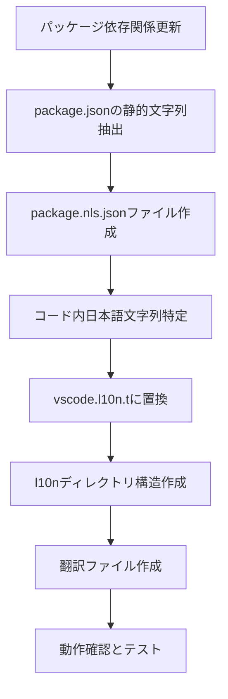

# 作業チケット: vscode-l10nを使用したi18n対応

## 1. 概要と方針

現在のコードベースで日本語のユーザー向けメッセージがハードコーディングされている箇所を、VS Code公式のi18nライブラリ `vscode-l10n` を使用して国際化対応させる。コメントは日本語のまま維持し、ユーザー向けメッセージのみを対象とする。

**方針**:
- VS Code公式の `vscode-l10n` を使用
- 日本語（ja）と英語（en）に対応
- `vscode.l10n.t()` APIでコード内文字列を翻訳
- `package.nls.json` でpackage.jsonの静的コントリビューションを翻訳
- VS Codeエンジンバージョンを `^1.73.0` 以上に更新

## 2. 主な処理フロー

## 3. 主要関数・モジュール

### 対象ファイル
- `package.json`: エンジンバージョン更新、静的コントリビューション
- `src/utils/file-explorer.ts`: エラーメッセージ
- `src/config/configuration.ts`: バリデーションメッセージ
- `src/commands/sync/sync-command.ts`: 通知メッセージ
- `src/commands/trans/trans-command.ts`: エラーメッセージ
- `src/commands/chat/chat-command.ts`: プロンプト、エラーメッセージ
- `src/api/providers/vscode-lm-provider.ts`: エラーメッセージ

### 新規作成ファイル
- `package.nls.json`: 英語（デフォルト）翻訳
- `package.nls.ja.json`: 日本語翻訳
- `l10n/bundle.l10n.json`: コード内文字列の英語翻訳
- `l10n/bundle.l10n.ja.json`: コード内文字列の日本語翻訳

## 4. 考慮事項

- **VS Codeエンジンバージョン**: `^1.73.0`以上に更新が必要
- **後方互換性**: 既存の機能に影響しないよう注意
- **メッセージキー**: 階層構造で管理し、意味が分かりやすいキー名を使用
- **フォールバック**: 翻訳が見つからない場合は英語にフォールバック
- **テスト**: 既存のテストが正常に動作することを確認
- **開発ツール**: `@vscode/l10n-dev`は開発時のみ使用（実行時依存関係に含めない）

## 5. 実装計画と進捗

- [x] VS Codeエンジンバージョンを`^1.73.0`に更新
- [x] package.jsonの静的コントリビューションを特定
- [x] package.nls.jsonファイルを作成（英語・日本語）
- [x] コード内の日本語文字列を特定・分類
- [x] vscode.l10n.t()を使用した翻訳に置換
- [x] l10nディレクトリとバンドルファイルを作成
- [x] 翻訳ファイルを作成（英語・日本語）
- [x] package.jsonにl10n設定を追加
- [ ] 既存テストの動作確認
- [ ] 各言語での動作確認
- [ ] エラーハンドリングの確認

## 6. 実装メモ・テスト観点

### 完了した実装
- **パッケージ設定**: `package.json`にl10n設定を追加し、VS Codeエンジンバージョンを`^1.73.0`に更新
- **静的コントリビューション**: `package.nls.json`と`package.nls.ja.json`でコマンド、設定、説明文を翻訳
- **動的メッセージ**: 以下のファイルでユーザー向けメッセージを`vscode.l10n.t()`に置換
  - `src/utils/file-explorer.ts`: ファイル操作エラーメッセージ
  - `src/config/configuration.ts`: 設定バリデーションメッセージ
  - `src/commands/sync/sync-command.ts`: 同期処理通知メッセージ
  - `src/commands/trans/trans-command.ts`: 翻訳処理プロンプト・通知メッセージ
  - `src/commands/chat/chat-command.ts`: チャット処理プロンプト・エラーメッセージ
  - `src/api/providers/vscode-lm-provider.ts`: 言語モデルエラーメッセージ
- **翻訳ファイル**: `l10n/bundle.l10n.json`（英語）と`l10n/bundle.l10n.ja.json`（日本語）を作成

### テスト観点
- テスト環境でのGitHub Copilot未使用によるエラーは正常（Language model not available）
- エラーハンドリングでエラーメッセージが適切に国際化されていることを確認
- 日本語・英語環境での表示確認が必要

## 7. 次のステップ

実装完了後、必要に応じて他の言語（中国語、韓国語など）への拡張を検討する。

### 残りの作業
- VS Code開発環境での日本語・英語切り替えテスト
- 実際の拡張機能動作でのメッセージ表示確認
- テスト環境でのGitHub Copilot依存問題の対処（モック化など）
