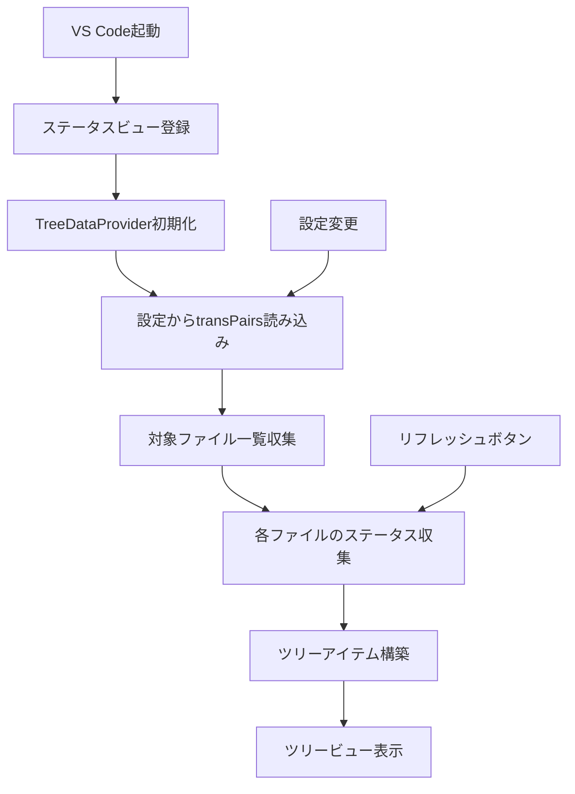

# 作業チケット: ステータス表示UIの基本実装

## 1. 概要と方針

VS Codeのサイドパネルにツリービュー形式でファイルとユニットの翻訳状況を表示する基本機能を実装します。第一段階として、ツリービューの表示、ステータス収集、基本的なアイコン表示に絞って実装を行います。

### 実装範囲
- ツリービューの基本構造（ViewContainer + TreeDataProvider）
- ファイル単位での翻訳状況収集
- 基本的なアイコン表示（翻訳済み、翻訳が必要、エラー状態）
- リフレッシュ機能

### 実装範囲外（後続チケットで対応）
- ユニット詳細表示
- 統計表示`(12/55)`形式
- ファイル/ユニットへのナビゲーション機能
- 高度なアイコン分類

## 2. 主な処理フロー



## 3. 主要関数・モジュール

### 新規作成ファイル
- `src/ui/status/status-tree-provider.ts`: TreeDataProviderの実装
- `src/ui/status/status-item.ts`: ツリーアイテムのデータ構造
- `src/ui/status/status-collector.ts`: ファイル翻訳状況の収集ロジック
- `src/test/ui/status/status-tree-provider.test.ts`: ツリープロバイダのテスト

### 修正ファイル
- `package.json`: views、viewsContainers設定を追加
- `src/extension.ts`: ステータスビュー登録
- `package.nls.json`, `package.nls.ja.json`: UI文言追加

### 主要インターフェース
```ts
interface StatusItem {
  type: 'file' | 'unit';
  label: string;
  filePath?: string;
  status: 'translated' | 'needsTranslation' | 'error' | 'unknown';
  children?: StatusItem[];
}
```

## 4. 考慮事項

- **パフォーマンス**: 大量のファイルがある場合の処理速度
- **エラーハンドリング**: ファイル読み込みエラーやパース失敗への対応
- **設定変更への対応**: transPairs変更時のリフレッシュ
- **既存コードとの連携**: Configuration、Parser、FileExplorerの活用
- **国際化**: UI文言のl10n対応

## 5. 実装計画と進捗

- [x] `package.json`でviewsContainer、views設定追加
- [x] `StatusItem`インターフェース定義
- [x] `StatusCollector`クラス実装（ファイル状況収集）
- [x] `StatusTreeProvider`クラス実装（TreeDataProvider）
- [x] `extension.ts`でビュー登録
- [x] 基本的なアイコン設定（VS Code組み込みアイコン使用）
- [x] リフレッシュコマンド実装
- [x] 国際化対応（文言追加）
- [x] 基本動作テスト

## 6. 実装メモ・テスト観点

### 実装完了内容
- **ViewContainer & Views設定**: `package.json`にmdaitアクティビティバーコンテナと翻訳状況ビューを追加
- **StatusItem**: ツリーアイテムの基本データ構造を定義（ファイル/ユニット対応）
- **StatusCollector**: 設定に基づくファイル状況収集ロジックを実装
- **StatusTreeProvider**: VS Code TreeDataProviderインターフェースを実装
- **拡張機能登録**: extension.tsでツリービューとリフレッシュコマンドを登録
- **国際化**: 英語・日本語の静的および動的メッセージを追加

### 実装で解決した課題
- **MdaitUnit構造**: `unit.marker.need`でneedフラグにアクセス
- **Configuration型**: `ignoredPatterns`は文字列型（配列ではない）
- **VS Code API**: TreeViewの適切なイベント処理とアイコン設定

### テスト観点
- 設定されたtransPairsに基づいた正しいファイル一覧取得
- ファイルパース成功/失敗時の適切なステータス設定
- ツリーアイテムの正しい階層構造
- リフレッシュ機能の動作確認

## 7. 次のステップ

基本実装完了後、以下の機能を段階的に追加：
1. ユニット詳細表示機能
2. 統計表示`(12/55)`機能
3. ナビゲーション機能（ファイル/ユニットジャンプ）
4. アイコンの詳細分類（need:translate、need:review等）
