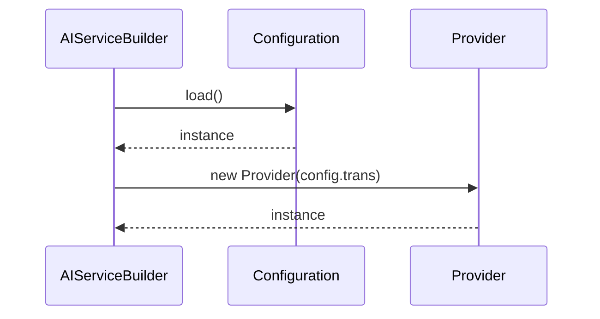

# 作業チケット: 設定インターフェースの統合

## 1. 概要と方針

`AIServiceConfig`と`Configuration`の間の冗長性を解消し、設定管理をより単純で保守しやすい構造に統合します。

- `AIServiceConfig`インターフェースを削除
- 各プロバイダが`Configuration.trans`オブジェクトを直接使用
- 設定のマッピング処理を削除してシンプルに

## 2. 主な処理フロー

## 3. 主要関数・モジュール

### 変更対象ファイル
- `src/api/ai-service-builder.ts`: `AIServiceConfig`削除、`Configuration`直接使用
- `src/api/providers/default-ai-provider.ts`: コンストラクタ引数変更
- `src/api/providers/vscode-lm-provider.ts`: コンストラクタ引数変更  
- `src/api/providers/ollama-provider.ts`: コンストラクタ引数変更
- `src/commands/trans/translator-builder.ts`: 型参照更新

## 4. 考慮事項

- 各プロバイダが必要とする設定項目を`Configuration.trans`で適切に表現
- 型安全性を保つため、`Configuration.trans`の型定義を明確化
- テストファイルの更新も必要

## 5. 実装計画と進捗

- [x] `Configuration.trans`の型定義を明確化
- [x] `AIServiceConfig`インターフェースの削除
- [x] `AIServiceBuilder`の変更
- [x] 各プロバイダのコンストラクタ変更
- [x] `TranslatorBuilder`の型参照更新
- [x] テストファイルの更新
- [x] 動作確認

## 6. 実装メモ・テスト観点

### 実装完了内容
- `AIServiceConfig`インターフェースを完全に削除し、`TransConfig`に統合
- 各プロバイダが`Configuration.trans`オブジェクトを直接受け取るように変更
- `AIServiceBuilder.loadConfiguration()`で単純にconfig.transを返すように簡素化
- マッピング処理を完全に削除し、設定の冗長性を解消

### テスト結果
- 全プロバイダのテストが正常に動作することを確認
- 設定の読み込みと型安全性が保たれていることを確認

### 設計上の改善点
- 設定管理が一元化され、保守性が向上
- 新しいプロバイダ追加時の作業量が削減
- 型安全性を保ちながらシンプルな構造を実現

## 7. 次のステップ

設定インターフェースの統合が完了しました。この変更により：
- コードの保守性が向上
- 設定の冗長性が解消
- 新機能追加時の作業効率が向上

今後、新しいプロバイダを追加する際は、`Configuration.trans`に必要な設定を追加するだけで済みます。
