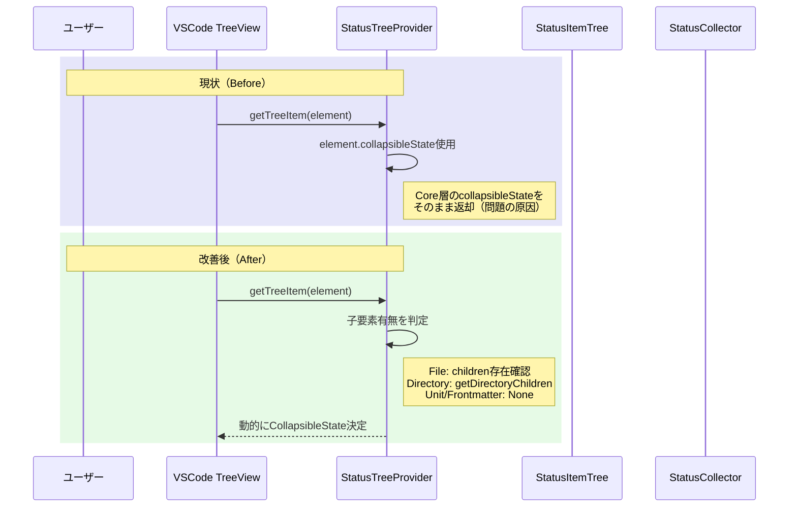

# 作業チケット: StatusパネルのcollapsibleState管理リファクタリング

## 1. 概要と方針

ツリー展開時にサークルが表示されたまま開かない問題を解消するため、`collapsibleState`の管理をCore層からUI層（`StatusTreeProvider.getTreeItem`）へ移行する。VSCodeの標準的なTreeView管理に従い、`getTreeItem`で子要素の有無に基づいて動的に`collapsibleState`を決定することで、VSCodeの自動開閉管理との競合を排除する。

## 2. シーケンス図

## 3. 考慮事項

### 3.1 互換性の維持
- 現在のUI/UXは完全に維持する
- ファイル・ディレクトリ・ユニットの表示順序や階層構造は変更しない
- アイコン・ラベル・コンテキストメニューの動作は維持

### 3.2 責務の移行範囲
- `StatusItem`インターフェースから`collapsibleState`を削除しない（段階的移行のため）
- `StatusCollector`での`collapsibleState`設定は残すが、使用しない方向へ
- `StatusTreeProvider.getTreeItem`で動的判定に完全移行

### 3.3 テスト戦略
- 既存のGUIテストが通過することを確認
- 手動テストで展開・折りたたみ動作を検証

### 3.4 リスク
- VSCodeのTreeView APIの挙動に依存するため、API変更時の影響を受ける可能性
- 段階的移行により一時的にコードの重複が発生

## 4. 実装計画と進捗

- [ ] `StatusTreeProvider.getTreeItem`で`collapsibleState`を動的に決定するよう修正
  - Directoryタイプ: 子要素（ファイル・サブディレクトリ）があれば`Collapsed`
  - Fileタイプ: frontmatterまたはchildrenがあれば`Collapsed`
  - Unit/Frontmatterタイプ: 常に`None`
- [ ] 既存テスト（`npm test`）が通過することを確認
- [ ] コードレビューおよびCodeQL検査を実施
