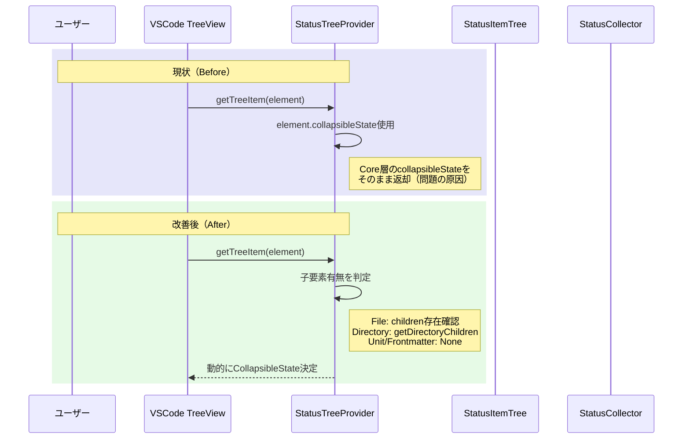

# 作業チケット: StatusパネルのcollapsibleState管理リファクタリング

## 1. 概要と方針

ツリー展開時にサークルが表示されたまま開かない問題を解消するため、`collapsibleState`の管理をCore層からUI層（`StatusTreeProvider.getTreeItem`）へ移行する。VSCodeの標準的なTreeView管理に従い、`getTreeItem`で子要素の有無に基づいて動的に`collapsibleState`を決定することで、VSCodeの自動開閉管理との競合を排除する。

## 2. シーケンス図

## 3. 考慮事項

### 3.1 互換性の維持
- 現在のUI/UXは完全に維持する
- ファイル・ディレクトリ・ユニットの表示順序や階層構造は変更しない
- アイコン・ラベル・コンテキストメニューの動作は維持

### 3.2 責務の移行とcollapsibleStateの削除
- UI層への完全移行後、`collapsibleState`プロパティは不要となる
- 以下の箇所から`collapsibleState`を削除する：
  - `BaseStatusItem`インターフェース（`status-item.ts`）
  - `StatusCollector`での設定処理（`status-collector.ts`）
  - `StatusItemTree`での設定処理（`status-item-tree.ts`）

### 3.3 テスト戦略
- 既存のGUIテストが通過することを確認
- 手動テストで展開・折りたたみ動作を検証

### 3.4 リスク
- VSCodeのTreeView APIの挙動に依存するため、API変更時の影響を受ける可能性

## 4. 実装計画と進捗

### Phase 1: UI層での動的判定に移行

- [ ] **4.1** `StatusTreeProvider.getTreeItem`を修正（`src/ui/status/status-tree-provider.ts`）
  - `determineCollapsibleState`メソッドを新規追加
  - 判定ロジック:
    - `StatusItemType.Directory`: 子要素があれば`Collapsed`、なければ`None`
    - `StatusItemType.File`: `frontmatter`または`children.length > 0`なら`Collapsed`
    - `StatusItemType.Unit`: 常に`None`
    - `StatusItemType.Frontmatter`: 常に`None`
  - `getTreeItem`の`new vscode.TreeItem(element.label, element.collapsibleState)`を`new vscode.TreeItem(element.label, this.determineCollapsibleState(element))`に変更

### Phase 2: Core層からcollapsibleStateを削除

- [ ] **4.2** `BaseStatusItem`から`collapsibleState`プロパティを削除（`src/core/status/status-item.ts`）
  - 40行目の`collapsibleState?: vscode.TreeItemCollapsibleState;`を削除

- [ ] **4.3** `StatusCollector`から`collapsibleState`設定を削除（`src/core/status/status-collector.ts`）
  - `buildFileStatusItem`（197-200行目）: `collapsibleState`プロパティ削除
  - `buildEmptyFileStatusItem`（220行目）: `collapsibleState`プロパティ削除
  - `buildErrorFileStatusItem`（241行目）: `collapsibleState`プロパティ削除
  - `collectAllFromDirectory`エラー処理（476行目）: `collapsibleState`プロパティ削除

- [ ] **4.4** `StatusItemTree`から`collapsibleState`設定を削除（`src/core/status/status-item-tree.ts`）
  - `recalcDirectoryAggregate`（456-462行目）: `collapsibleState`設定ブロック削除
  - `createDirectoryStatusItem`（514-520行目）: `collapsibleState`プロパティ削除

### Phase 3: 検証

- [ ] **4.5** 既存テスト（`npm test`）が通過することを確認
- [ ] **4.6** コードレビューおよびCodeQL検査を実施
